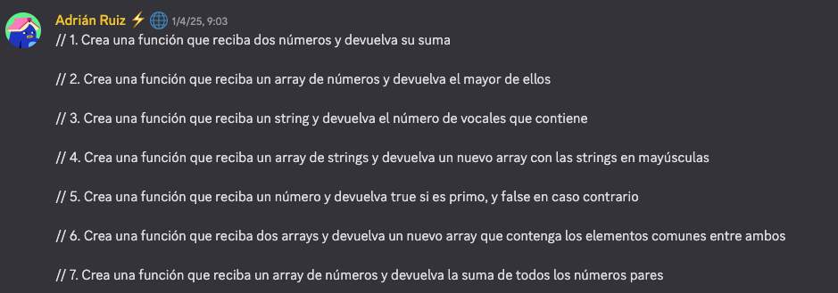

## Taller Funciones 01/04/2025

- [x]  1. Crea una función que reciba dos números y devuelva su suma
- [x]  2. Crea una función que reciba un array de números y devuelva el mayor de ellos
- [x]  3. Crea una función que reciba un string y devuelva el número de vocales que contiene
- [x]  4. Crea una función que reciba un array de strings y devuelva un nuevo array con las strings en mayúsculas
- [x]  5. Crea una función que reciba un número y devuelva true si es primo, y false en caso contrario ERROR NUMEROS PRIMOS NO PARES
- [x]  6. Crea una función que reciba dos arrays y devuelva un nuevo array que contenga los elementos comunes entre ambos
- [x]  7. Crea una función que reciba un array de números y devuelva la suma de todos los números pares

